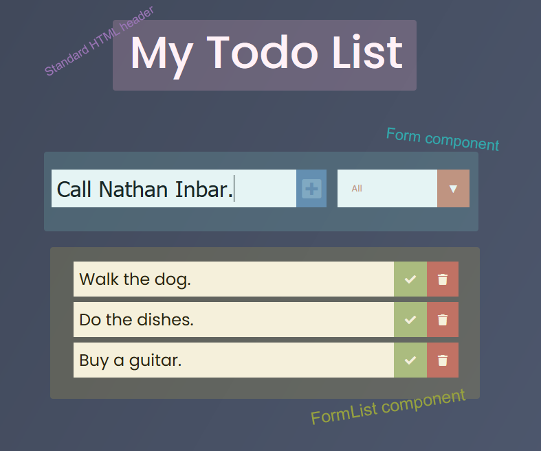

# React To-Do List
--

I absolutely despise front-end development, yet here I am. 🤔

Check out the app here: [To-Do List](https://justinstitt.github.io/reactToDoList/)

##### React makes interactive websites easier by splitting up the page via components.

### Form component: 
handles the entry of data to be sent to our FormList component which displays the data.

### FormList component:
displays all items in our todo list which is passed from App.js->Form.js->FormList.js 

(called TodoList.js in src)

## Local Storage (caching)
Your ToDo List is cached locally. The completed/uncompleted status is also saved.

To clear your local storage, open dev console (F12 on windows), navigate to "Storage" and clear "Local Storage"

## Resources:
--

* https://www.youtube.com/watch?v=pCA4qpQDZD8
* https://www.youtube.com/watch?v=ctLFWAanxcI&t=309s
* [React docs](https://reactjs.org/docs/getting-started.html)